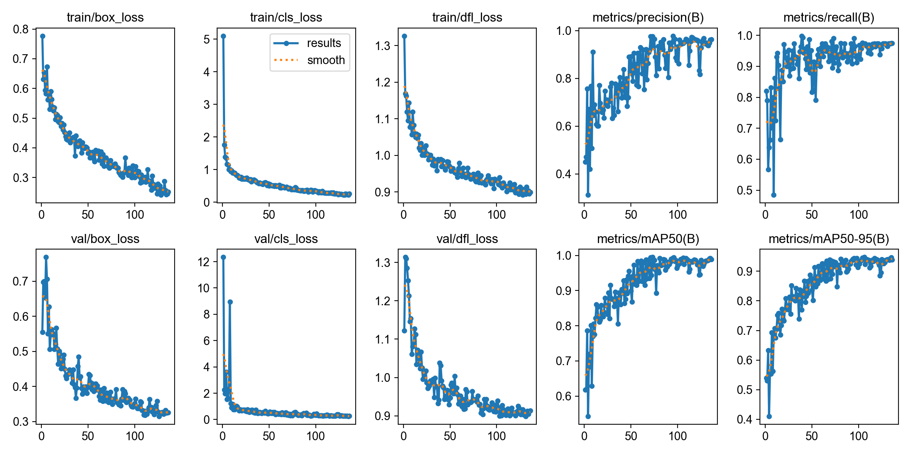
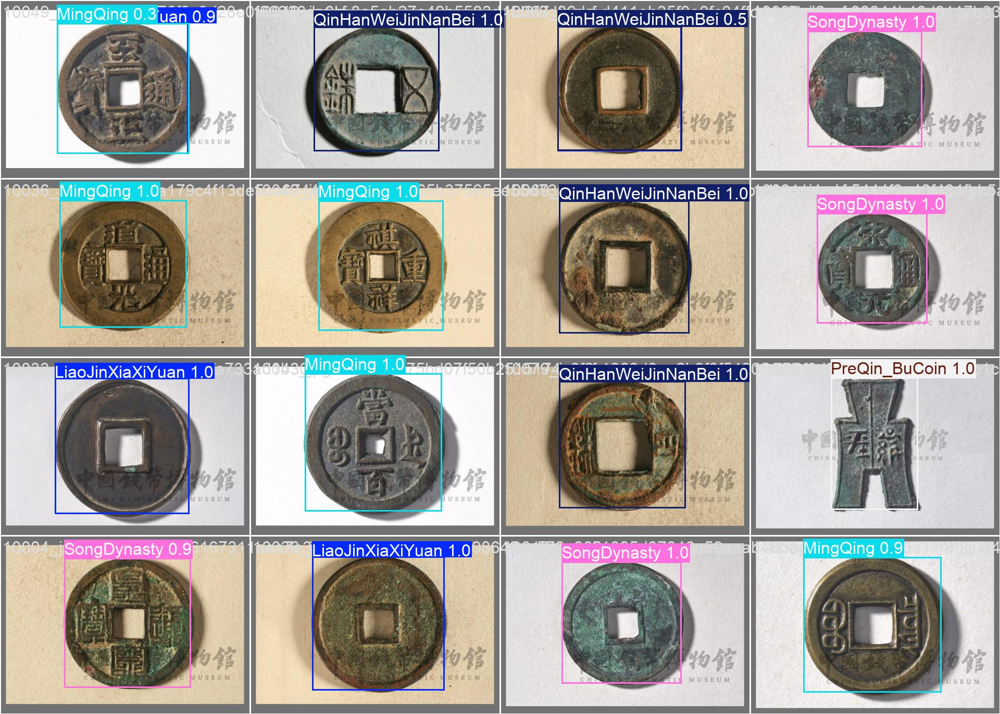

# 🪙 Ancient Coin Detection & Knowledge System (古钱币智能检测与科普系统)

[](https://www.python.org/)
[](https://github.com/ultralytics/ultralytics)
[](https://pypi.org/project/PySide6/)

## 📝 Introduction (项目简介)

本项目是一个集**深度学习目标检测**与**历史文化科普**于一体的古钱币智能识别系统。
系统基于 **YOLOv8** 算法，能够精准识别并分类六大类中国古代钱币。通过 **PySide6** 驱动的 GUI 界面，用户可实现一键上传、智能检测及历史背景查询。

## 📸 System Showcase (功能演示)

### 1. 桌面端交互界面 (GUI)


*(最新模型训练曲线)*

### 2. 识别效果 (Detection Result)


*(最新模型在测试集上的画框效果)*

## 🚀 Key Features (核心亮点)

- **High Precision**: 核心模型采用 YOLOv8s-768，测试集 mAP50 达到 **0.9729**，mAP50-95 达到 **0.9324**。
- **Interactive GUI**: 基于 PySide6 开发，支持图片上传、结果实时渲染与列表展示。
- **Knowledge Base**: 内置古钱币历史知识库，实现“识别+科普”的双重功能。
- **Performance Optimized**: 针对 RTX 4060 Laptop GPU 深度调优，单张图片推理时间约 **10.3ms**。

## 📊 Performance (模型性能对比)

基于 `data2_grouped/test` 的统一评估结果：

| 模型版本              | 输入尺寸 | mAP50     | mAP50-95  | Precision | Recall | 推理速度 (ms) |
|:------------------|:-----|:----------|:----------|:----------|:-------|:----------|
| **Release (推荐)** | 768  | **0.9729** | **0.9324** | 0.9351    | 0.9626 | 10.3      |
| YOLOv8s           | 640  | 0.9531    | 0.8991    | 0.8676    | 0.9336 | 8.2       |
| YOLOv8n           | 640  | 0.9187    | 0.8885    | 0.9286    | 0.8924 | 6.4       |

## 📂 Directory Structure (项目结构)

```text
.
├── best_models/          # 发布版模型权重
├── config/               # 数据集配置文件 (data.yaml)
├── archive/              # 旧数据、原始导出和旧实验结果归档
├── data2_grouped/        # 按原始图片编号重划分后的训练数据集
├── runs/                 # 实验日志与评估图表 (PR曲线、混淆矩阵)
├── main_gui.py           # 【核心】GUI 桌面系统启动脚本
├── train.py              # 模型训练脚本
├── compare_models.py     # 模型性能对比评估脚本
└── requirements.txt      # 环境依赖清单
```

## 🛠️ Usage (常用命令)

推荐使用 `uv` 运行项目：

```bash
uv --cache-dir .uv-cache sync
```

如果已经存在 `.venv`，日常运行可以跳过同步，避免重复下载依赖：

```bash
uv --cache-dir .uv-cache run --no-sync python dataset_check.py
```

启动桌面识别系统：

```bash
uv --cache-dir .uv-cache run --no-sync python main_gui.py
```

检查数据集图片与标签是否匹配：

```bash
uv --cache-dir .uv-cache run --no-sync python dataset_check.py
```

生成完整数据集检查报告：

```bash
uv --cache-dir .uv-cache run --no-sync python dataset_check.py --report data2_grouped_report.txt
```

重新生成无跨集合泄漏的数据集：

```bash
uv --cache-dir .uv-cache run --no-sync python split_dataset_by_origin.py --source archive/slim_20260427/data2 --output data2_grouped
```

训练模型：

```bash
uv --cache-dir .uv-cache run --no-sync python train.py --model pretrained/yolov8s.pt --name coin_v8s_768 --imgsz 768 --batch 8 --exist-ok
```

对示例图片运行预测并保存结果：

```bash
uv --cache-dir .uv-cache run --no-sync python predict.py --source samples --save
```

对比多个模型在测试集上的指标：

```bash
uv --cache-dir .uv-cache run --no-sync python compare_models.py
```

当前默认数据集是 `data2_grouped/`，配置入口为 `config/data.yaml`。当前默认推理模型是发布版 YOLOv8s 768：

```text
best_models/coin_v8s_768_best.pt
```

旧数据集、原始导出、历史实验和过时权重已移动到 `archive/legacy_20260427/` 与 `archive/slim_20260427/`，当前训练、预测和 GUI 不依赖其中内容。
