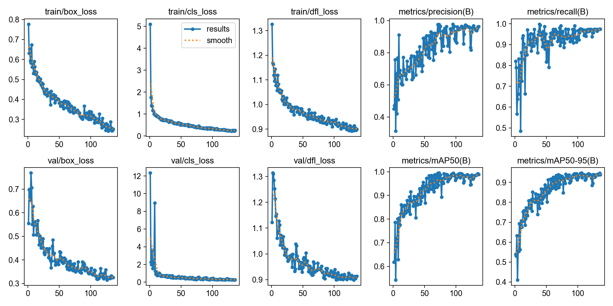
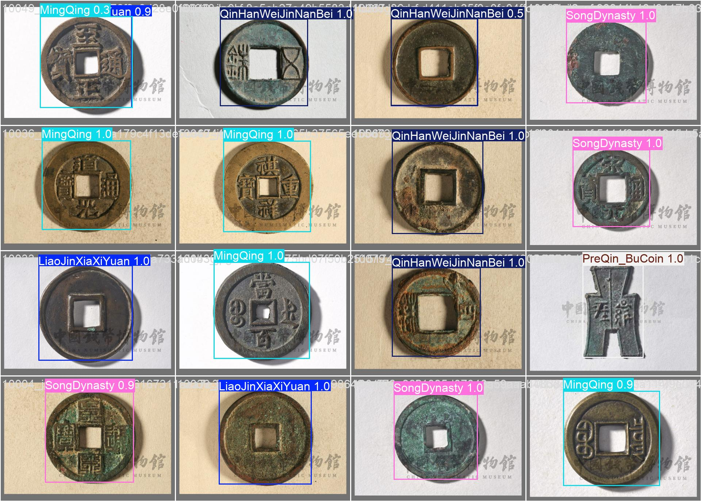

# 🪙 Ancient Coin Detection & Knowledge System (古钱币智能检测与科普系统)

[](https://www.python.org/)
[](https://github.com/ultralytics/ultralytics)
[](https://fastapi.tiangolo.com/)
[](https://react.dev/)

## 📝 Introduction (项目简介)

本项目是一个集**深度学习目标检测**与**历史文化科普**于一体的古钱币智能识别系统。
系统基于 **YOLOv8** 算法，面向六类中国古代钱币图像完成目标检测。项目现在聚焦 **FastAPI + React** Web 工作台，用户可在浏览器中完成图片上传、检测结果展示、置信度调节、结果保存及历史背景查询。

当前实验数据集由 395 张古钱币图像组成，使用 Roboflow 完成目标框标注，并划分为训练集 278 张、验证集 60 张、测试集 57 张。项目没有额外生成本地离线增强图片，训练阶段使用 YOLOv8 默认训练流程中的在线增强策略。原始训练图片仅保留在本地 `data/`，不随 GitHub 仓库上传。

## 📸 System Showcase (功能演示)

### 1. 训练结果曲线


*(最新模型训练曲线)*

### 2. 识别效果


*(最新模型在测试集上的画框效果)*

## 🚀 Key Features (核心亮点)

- **Model**: 核心模型采用 YOLOv8s-768，测试集 mAP50 达到 **0.9698**，mAP50-95 达到 **0.9300**。
- **Dataset**: 本地实验数据集包含 395 张古钱币图像，按 YOLO 格式组织为训练集、验证集和测试集。
- **Web**: 基于 FastAPI 和 React/Vite 构建本机浏览器工作台，后端负责 YOLO 推理，前端负责上传、预览、检测列表、科普详情和结果下载。
- **Knowledge Base**: 内置六类古钱币历史知识说明，实现“识别+科普”的演示效果。

## 📊 Performance (模型性能对比)

基于本地 `data/test` 的统一评估结果：

| 模型版本              | 输入尺寸 | mAP50     | mAP50-95  | Precision | Recall | 推理速度 (ms) |
|:------------------|:-----|:----------|:----------|:----------|:-------|:----------|
| **YOLOv8s (推荐)** | 768  | **0.9698** | **0.9300** | 0.9524    | 0.9678 | 约 9ms   |
| YOLOv8n           | 768  | 0.9142    | 0.8663    | 0.8241    | 0.9423 | 约 8ms   |
| YOLOv8s           | 640  | 0.9531    | 0.8991    | 0.8676    | 0.9336 | 约 10ms  |
| YOLOv8n           | 640  | 0.9187    | 0.8885    | 0.9286    | 0.8924 | 约 6ms   |

## 📂 Directory Structure (项目结构)

```text
.
├── best_models/          # 四组对比模型与发布版权重
├── config/               # 数据集配置文件 (data.yaml)
├── data/                 # 本地训练/验证/测试数据集（不上传）
├── runs/                 # 实验日志与评估图表 (PR曲线、混淆矩阵)
├── samples/              # Web API与预测演示图片
├── archive/              # 旧数据、原始导出和旧实验结果归档
├── web_backend/          # FastAPI 推理服务
├── frontend/             # React/Vite Web 工作台
├── train.py              # 模型训练脚本
├── dataset_check.py      # 数据集图片、标签和边界框检查脚本
├── compare_models.py     # 模型性能对比评估脚本
├── predict.py            # 命令行预测脚本
├── pyproject.toml        # 项目依赖配置
└── uv.lock               # 依赖锁定文件
```

## 🛠️ Usage (常用命令)

### 1. 环境准备

推荐使用 `uv` 管理 Python 环境，并使用 Node.js 运行 Web 前端：

```bash
uv --cache-dir .uv-cache sync
```

如果已经存在 `.venv`，日常运行可以跳过同步，避免重复下载依赖。前端依赖只需要在首次运行或 `package.json` 变更后安装：

```bash
uv --cache-dir .uv-cache run --no-sync python dataset_check.py
cd frontend
npm install
```

项目默认推理权重为：

```text
best_models/coin_v8s_768_best.pt
```

如果该文件不存在，Web 后端无法完成真实检测。

### 2. 启动 Web 工作台

开发模式需要同时启动 FastAPI 后端和 Vite 前端。

后端服务：

```bash
uv --cache-dir .uv-cache run --no-sync uvicorn web_backend.app:app --host 127.0.0.1 --port 8000
```

前端服务：

```bash
cd frontend
npm run dev
```

默认前端地址为 `http://127.0.0.1:5173`，开发期会将 `/api` 请求代理到 `http://127.0.0.1:8000`。

生产构建后可以只启动 FastAPI，由后端托管 `frontend/dist` 静态页面：

```bash
cd frontend
npm run build
cd ..
uv --cache-dir .uv-cache run --no-sync uvicorn web_backend.app:app --host 127.0.0.1 --port 8000
```

此时浏览器访问 `http://127.0.0.1:8000` 即可进入 Web 工作台。

Web API 入口：

| 方法 | 路径          | 说明 |
|:-----|:--------------|:-----|
| GET  | `/api/health` | 检查服务状态、模型文件是否存在、类别列表 |
| POST | `/api/detect` | 上传图片并按指定置信度执行检测，返回画框结果和科普说明 |

### 3. 数据集、训练与评估

检查数据集图片与标签是否匹配：

```bash
uv --cache-dir .uv-cache run --no-sync python dataset_check.py
```

生成完整数据集检查报告：

```bash
uv --cache-dir .uv-cache run --no-sync python dataset_check.py --report data_report.txt
```

训练模型：

```bash
uv --cache-dir .uv-cache run --no-sync python train.py --model pretrained/yolov8s.pt --name coin_v8s_768 --imgsz 768 --batch 8 --exist-ok
```

对示例图片运行预测并保存结果：

```bash
uv --cache-dir .uv-cache run --no-sync python predict.py --source samples --save
```

对比多个模型在测试集上的指标：

```bash
uv --cache-dir .uv-cache run --no-sync python compare_models.py
```

当前默认数据集是本地 `data/`，配置入口为 `config/data.yaml`。`best_models/` 里已经整理出四组可直接复现的对比权重，`compare_models.py` 默认就会按各自输入尺寸评估它们。Web 后端默认推理模型是发布版 YOLOv8s 768：

```text
best_models/coin_v8s_768_best.pt
```

旧数据集、原始导出、历史实验、历史整理脚本和过时权重主要用于备份追溯；当前训练、预测和 Web 默认流程不依赖这些归档内容。
